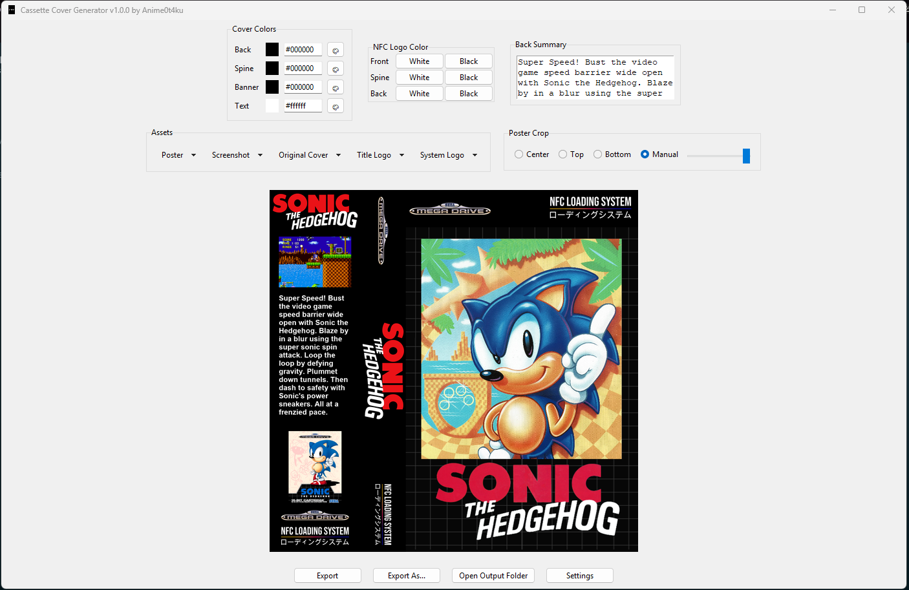

# NFC Cassette Cover Generator

NFC Cassette Cover Generator is a Windows desktop application for creating a **single print-ready cassette wrap cover**.

Each export generates one complete cover image consisting of:

- Back  
- Spine  
- Front  

The output is designed for printing and folding into a physical cassette-style case, ideal for NFC projects, retro collections, and custom launch systems.



---

## Download

Pre-built Windows executables are generated automatically via GitHub Actions.

### Nightly Build

| Name | Platform | Status | Download |
|------|----------|--------|----------|
| NFC Cassette Cover Generator | Windows | [](https://github.com/Anime0t4ku/NFC-Cassette-Cover-Generator/actions/workflows/build.yml) | [Download ZIP](https://github.com/Anime0t4ku/NFC-Cassette-Cover-Generator/releases/download/Pre-release/NFC-Cassette-Cover-Generator-Windows-x86_64.zip) |

---

## Features

- Desktop GUI built with Tkinter  
- Live full-wrap preview (Back + Spine + Front combined)  
- Customizable cover colors (back, spine, banner, text)  
- Import artwork from file or URL  
- Separate logo overrides per side  
- Automatic image scaling and positioning  
- Back summary text with dynamic wrapping  
- Timestamped exports  
- "Export As…" option  
- Configurable output directory  
- Persistent settings via `config.json`  

---

## Future API Support

API integration (for example, automatic poster, logo, or metadata retrieval) may be explored in future releases.

However, generating a single complete cover would require combining data from multiple APIs, which increases complexity significantly.  
For this reason, API support is **not guaranteed** and may remain optional or manual.

---

## Output

- Single high-resolution PNG file  
- Combined Back + Spine + Front layout  
- Timestamped filenames  
- One-click open output directory  
- Manual save location via "Export As…"  

---

## Supported Platform

### Windows

Pre-built executable provided.  
No Python installation required.

---

## Running From Source (Windows Only)

Only required if you want to run or modify the script directly.

### Requirements

- Python 3.9+
- Pillow
- Requests

Install dependencies:

```
pip install pillow requests
```

Run:

```
cd nfc-cassette-cover-generator
python nfc-cassette-cover-generator.py
```

---

## License

This project is licensed under the **GNU General Public License v2.0 (GPL-2.0)**.

See the `LICENSE` file for full license details.