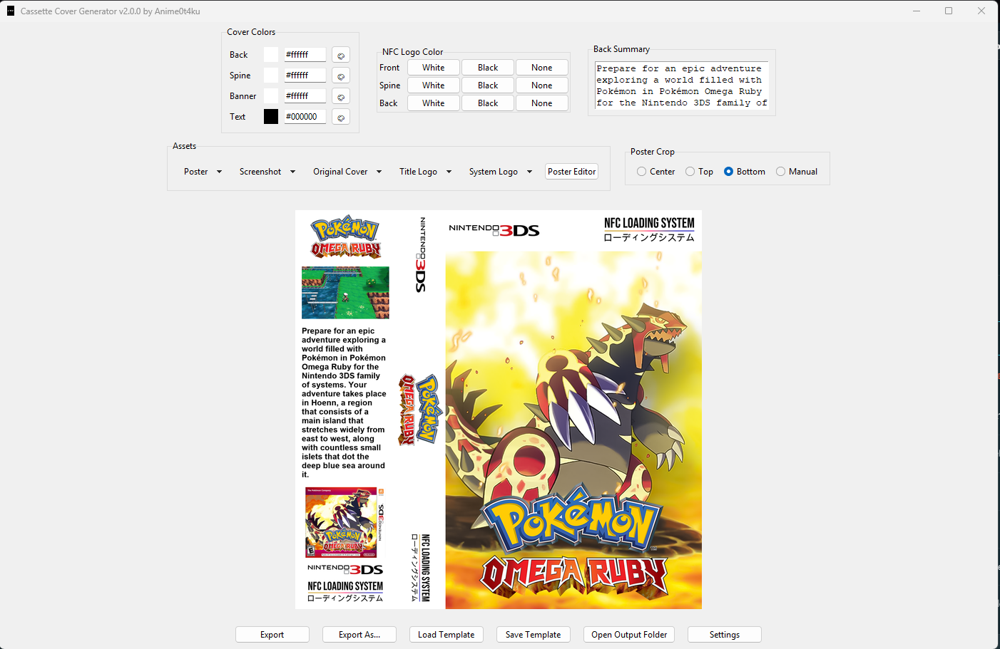

# NFC Cassette Cover Generator

NFC Cassette Cover Generator is a desktop application for creating a **single print-ready cassette wrap cover**.

Each export generates one complete cover image consisting of:

- Back  
- Spine  
- Front  

The output is designed for printing and folding into a physical cassette-style case, ideal for NFC projects, retro collections, and custom launch systems.

---

## Download

Pre-built executables are generated automatically via GitHub Actions.

### Latest Release

| Name | Platform | Status | Download |
|------|----------|--------|----------|
| NFC Cassette Cover Generator | Windows |  | [Download Latest Release](https://github.com/Anime0t4ku/NFC-Cassette-Cover-Generator/releases/download/Pre-release/NFC-Cassette-Cover-Generator-Windows-x86_64.zip) |
| NFC Cassette Cover Generator | Linux |  | [Download Latest Release](https://github.com/Anime0t4ku/NFC-Cassette-Cover-Generator/releases/download/2.1.0/NFC-Cassette-Cover-Generator-Linux-x86_64.tar.gz) |

---

## Features (v2.0.0)

### Cover Design

- Live full-wrap preview (Back + Spine + Front combined)
- Customizable cover colors (back, spine, banner, text)
- Back summary text with dynamic wrapping
- Automatic image scaling and positioning
- Title logo overrides per side
- System logo overrides per side
- Optional original cover artwork on back
- Poster crop modes (Center / Top / Bottom / Manual slider)
- Optional NFC loading system logo (White / Black / Hidden)

### Poster Editor

- Add overlay images from file or URL
- Drag and reposition overlays
- Resize overlays using corner handles
- Overlay layer ordering
- Delete individual overlays
- Clear all overlays
- Apply edited poster directly to the cover
- Confirmation dialog before permanently applying edits

### Asset Import

- Import artwork from file
- Import artwork from URL
- SteamGridDB integration (posters + title logos)
- TMDB integration (movies & TV)
- Unified search system with selectable API sources
- System logo folder search
- Optional web logo caching

### Asset Management

- Clear buttons available directly in asset menus
- Individual assets can be reset without restarting the app

### Templates

- Save reusable templates
- Load templates to quickly restore colors and system logos

### Workflow

- Timestamped exports
- “Export As…” option
- Configurable output directory
- One-click open output folder
- Persistent settings via `config.json`
- Redesigned clean Settings panel

---

## Output

- Single high-resolution PNG file
- Combined Back + Spine + Front layout
- Print-ready wrap format
- Timestamped filenames
- Manual save location via "Export As…"

---

## Supported Platform

### Windows

Pre-built executable provided.  
No Python installation required.

---

## Running From Source

Only required if you want to run or modify the script directly.

### Requirements

- Python 3.9+
- Pillow
- Requests

Install dependencies:

    pip install pillow requests

Run:

    python nfc-cassette-cover-generator.py

---

## License

This project is licensed under the **GNU General Public License v2.0 (GPL-2.0)**.

See the `LICENSE` file for full license details.
